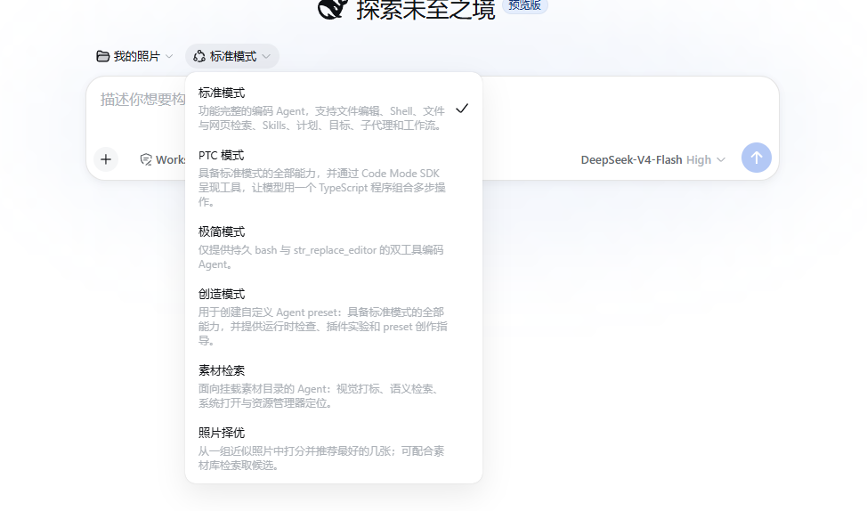
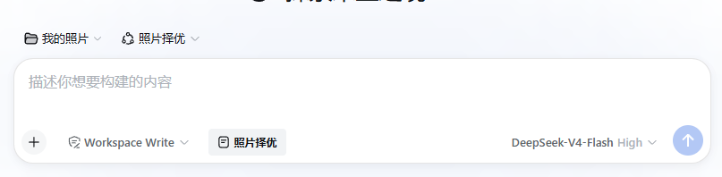

<p align="center">
  <h1 align="center">dsh-photo-pick</h1>
  <p align="center"><b>Pick the best shot from a burst.</b><br/>A DeepSeek Harness (dsh) plugin that scores similar photos with vision and recommends winners.</p>
  <p align="center">
    <a href="./README.md">中文</a> ·
    <a href="./README.en.md">English</a> ·
    <a href="https://github.com/xiaoyaoPanPan/dsh-photo-pick/issues">Issues</a>
  </p>
  <p align="center">
    <a href="LICENSE"></a>
    <a href="https://nodejs.org"></a>
    <a href="https://github.com/topics/dsh-plugin"></a>
    <a href="https://github.com/xiaoyaoPanPan/dsh-photo-pick/stargazers"></a>
    <a href="https://github.com/xiaoyaoPanPan/dsh-photo-pick/issues"></a>
  </p>
</p>

## Install in 10 seconds

Copy this prompt to Cursor / ChatGPT / Claude / DeepSeek Harness / your coding agent:

```text
Follow https://github.com/xiaoyaoPanPan/dsh-photo-pick/blob/main/INSTALL.en.md
to install dsh-photo-pick into my DeepSeek Harness web profile.
After install: with dsh web running, GET /api/photo-pick/settings, check for any model with supportsVision=true, and report what you found.
- If yes: ask me whether to wire it into Photo pick; only if I agree, PUT the same endpoint with visionEnabled=true and that visionLlmProvider / visionModel.
- If no: walk me through https://github.com/xiaoyaoPanPan/dsh-photo-pick/blob/main/SETUP-VISION.en.md to add a vision-capable custom model (do not push a specific vendor), then ask again whether to wire it up.
Report each step.
```

## Or install yourself

Needs official `dsh` and a working `dsh web` profile.

```sh
dsh plugin --profile web add "github:xiaoyaoPanPan/dsh-photo-pick#path:dsh-photo-pick-app"
```

On pnpm 11: first set `blockExoticSubdeps: false` in `~/.dsh/profiles/web/pnpm-workspace.yaml` (or `$DSH_HOME/profiles/web/…`), then run the `add` above. If pnpm asks for `allowBuilds`, paste the printed keys and re-run. Next:

```sh
pnpm --dir "${DSH_HOME:-$HOME/.dsh}/profiles/web" exec dsh-photo-pick-setup-preset
```

Windows PowerShell:

```powershell
pnpm --dir "$env:USERPROFILE\.dsh\profiles\web" exec dsh-photo-pick-setup-preset
```

Hard-refresh or restart `dsh web`. For scoring, use **Settings → Photo pick**, or see [SETUP-VISION.en.md](SETUP-VISION.en.md).

## Use

### Switch mode and pick

1. **Mount a workspace with photos** (top-left folder) and **start a new chat**.
2. Open the mode dropdown above the composer (default **标准模式**) and switch to **照片择优**.

   

3. In the composer toolbar, click **照片择优** → the photo picker opens.

   

4. Select photos → **Next** (optional this-batch criteria) → **Confirm to chat** → Send.
5. When the agent finishes, click **Compare** on the tool card.

Notes: the composer **照片择优** button appears only in **照片择优** mode. This-batch criteria apply once; long-term taste lives under Scoring standard in Settings.

## Uninstall

```sh
dsh plugin --profile web remove dsh-photo-pick-app
rm -rf "${DSH_HOME:-$HOME/.dsh}/.agent-presets/photo-pick"
```

## Author

[xiaoyaoPanPan](https://github.com/xiaoyaoPanPan) · [Issues](https://github.com/xiaoyaoPanPan/dsh-photo-pick/issues) · [MIT](LICENSE)

<details>
<summary>For developers</summary>

- Packages: `dsh-photo-pick` / `-local` / `-ui` / `dsh-tool-photo-pick` / `dsh-photo-pick-app` (consumers install app only).
- git / prebuilt `lib/`: [OPENSOURCE.en.md](OPENSOURCE.en.md) · AI install: [INSTALL.en.md](INSTALL.en.md) · AI vision: [SETUP-VISION.en.md](SETUP-VISION.en.md).
- Local: `dsh plugin --profile web add "file:./dsh-photo-pick-app"`, then `dsh-photo-pick-setup-preset`.

</details>
